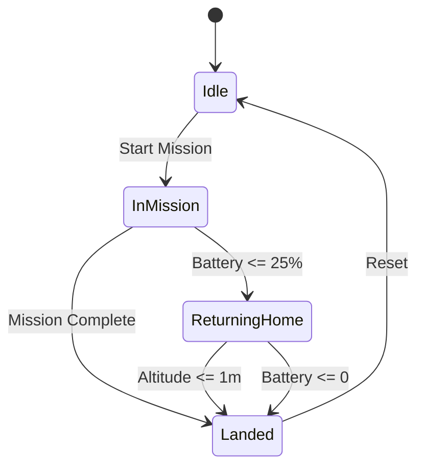

# DroneGCS (Ground Control Station)

A web-based ground control station for managing and monitoring drones.

## Tech Stack

- **Frontend:**

  - Next.js 15
  - TypeScript
  - Tailwind CSS
  - shadcn/ui Components
  - Leaflet.js for mapping
  - WebSocket Client

- **Backend:**
  - Node.js with Express
  - WebSocket Server
  - In-memory state management

## Setup Instructions

1. Clone the repository

```bash
git clone https://github.com/yourusername/dronegcs.git
cd dronegcs
```

2. Install dependencies (for both Frontend and Backend Folder)

```bash
cd Frontend && npm install
cd ../Backend && npm install
```

3. Start the WebSocket server (in Backend folder)

```bash
npm run dev
```

4. Run the Next.js development server (in Frontend folder)

```bash
npm run dev
```

5. Access the application:

- Frontend: http://localhost:3000
- Backend: http://localhost:8080

## API Contract

### WebSocket Communication

The WebSocket server sends drone state updates every 2 seconds with the following structure:

```typescript
// Drone State Structure
{
  battery: number; // Battery percentage (0-100)
  latitude: number; // Current latitude
  longitude: number; // Current longitude
  altitude: number; // Current altitude in meters
  status: "idle" | "in_mission" | "returning_home" | "landed";
}
```

### REST Endpoints

1. Start Mission

```typescript
POST / start - mission;
Response: {
  message: string;
  status: string;
}
```

2. Get Status

```typescript
GET / status;
Response: DroneState;
```

## State Machine

The drone follows these state transitions:



## Features

- Real-time drone tracking on an interactive map
- Live telemetry data including:
  - Battery level
  - Altitude
  - GPS coordinates
- Automatic return-to-home on low battery
- Mission control capabilities
- Dark/Light mode support

## Screenshots/Demo

### Dashboard View


