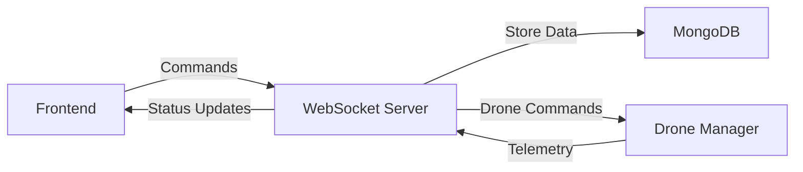

# DroneGCS (Ground Control Station)

A web-based ground control station for managing and monitoring drones.

## Tech Stack

- **Frontend:**

  - Next.js 13
  - TypeScript
  - Tailwind CSS
  - WebSocket Client

- **Backend:**
  - Node.js
  - WebSocket Server
  - MongoDB

## Setup Instructions

1. Clone the repository

```bash
git clone https://github.com/yourusername/dronegcs.git
cd dronegcs
```

2. Install dependencies

```bash
npm install
```

3. Start the WebSocket server (in a separate terminal)

```bash
node server.js
```

5. Run the Next.js development server (in another terminal)

```bash
npm run dev
```

6. Access the application:

- Frontend: http://localhost:3000
- WebSocket Server: ws://localhost:8080

## API Contract

### WebSocket Events

1. Drone Connection

```typescript
// Connect drone
emit("drone:connect", { droneId: string });

// Drone connected response
on("drone:connected", {
  droneId: string,
  status: "connected" | "error",
});
```

2. Telemetry Data

```typescript
// Receive telemetry
on("telemetry:update", {
  droneId: string,
  position: {
    latitude: number,
    longitude: number,
    altitude: number,
  },
  battery: number,
  speed: number,
});
```

3. Command Control

```typescript
// Send command
emit("drone:command", {
  droneId: string,
  command: "takeoff" | "land" | "return" | "move",
  params: {
    altitude: number,
    speed: number,
  },
});
```

## Data Flow Diagram

Create a data flow diagram using any diagram tool (e.g., draw.io, mermaid) showing:

1. Components:

   - Frontend (Next.js)
   - WebSocket Server
   - Database
   - Drone Connection Manager

2. Data Flow Directions:

   - User Interface ↔ WebSocket Client
   - WebSocket Client ↔ WebSocket Server
   - WebSocket Server ↔ Drone Connection Manager
   - WebSocket Server ↔ Database

3. Key Operations:
   - User commands
   - Telemetry updates
   - Database operations
   - Real-time data flow

Example Mermaid Diagram:



## Screenshots/Demo

### Dashboard View


